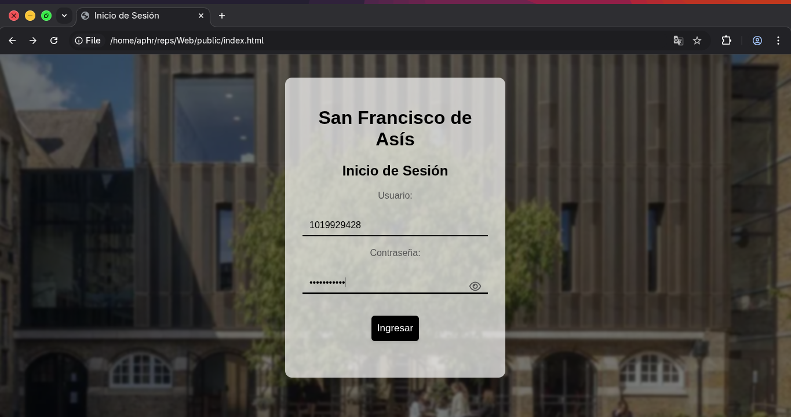
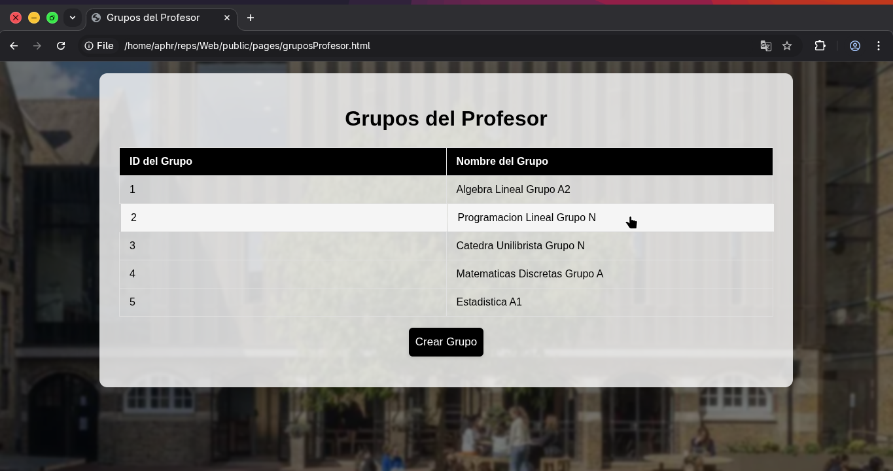

# Web
School management web platform. Built with JavaScript, ExpressJS, and powered by MySQL.

#

install dependencies
```
npm install express body-parser mysql cors multer
npm install -g http-server
```
# In Action Screenshots




