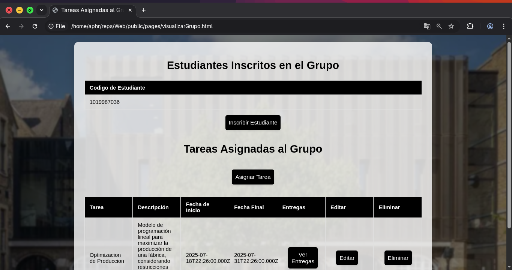

# Web
Full Stack Project: School management web platform. Built with Vanilla CSS, JavaScript, ExpressJS, and powered by MySQL.
# Execution Instructions
Install dependencies:
```
npm install -g http-server
npm install express body-parser mysql cors multer
```
Execute in /src:
```
node server.js
```
# In Action Screenshots





